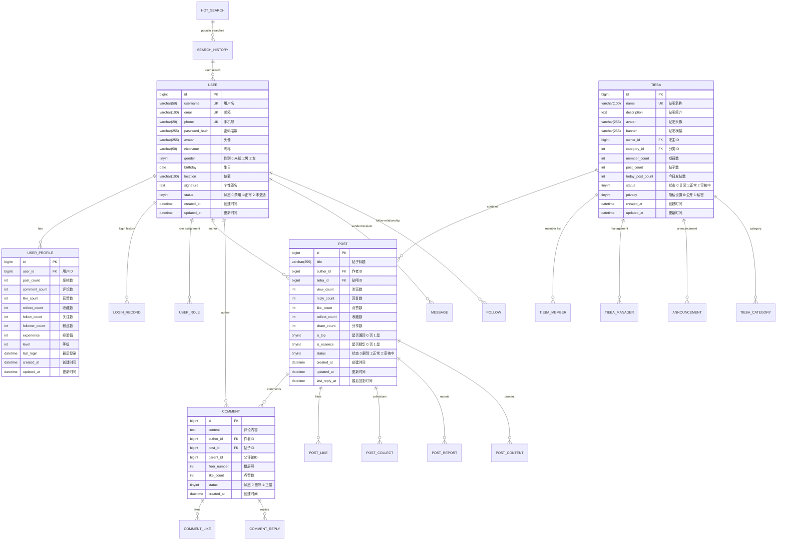

# 百度贴吧项目数据库设计文档

## 1. 数据库整体架构

### 1.1 数据库选型
- **主数据库**: MySQL 8.0
- **缓存数据库**: Redis 6.0+
- **搜索引擎**: Elasticsearch 7.x (可选)
- **文件存储**: 本地文件系统 + CDN

### 1.2 数据库设计原则
- 遵循第三范式设计
- 合理使用索引优化查询性能
- 适当使用冗余字段减少关联查询
- 考虑数据扩展性和维护性

## 2. 数据库ER图



## 3. 数据表详细设计

### 3.1 用户相关表

#### 3.1.1 用户表 (user)
```sql
CREATE TABLE user (
    id BIGINT PRIMARY KEY AUTO_INCREMENT COMMENT '用户ID',
    username VARCHAR(50) UNIQUE NOT NULL COMMENT '用户名',
    email VARCHAR(100) UNIQUE COMMENT '邮箱',
    phone VARCHAR(20) UNIQUE COMMENT '手机号',
    password_hash VARCHAR(255) NOT NULL COMMENT '密码哈希',
    avatar VARCHAR(255) DEFAULT '/static/images/default_avatar.png' COMMENT '头像',
    nickname VARCHAR(50) NOT NULL COMMENT '昵称',
    gender TINYINT DEFAULT 0 COMMENT '性别 0:未知 1:男 2:女',
    birthday DATE COMMENT '生日',
    location VARCHAR(100) COMMENT '位置',
    signature TEXT COMMENT '个性签名',
    status TINYINT DEFAULT 1 COMMENT '状态 0:禁用 1:正常 2:未激活',
    created_at TIMESTAMP DEFAULT CURRENT_TIMESTAMP COMMENT '创建时间',
    updated_at TIMESTAMP DEFAULT CURRENT_TIMESTAMP ON UPDATE CURRENT_TIMESTAMP COMMENT '更新时间',
    
    INDEX idx_username (username),
    INDEX idx_email (email),
    INDEX idx_phone (phone),
    INDEX idx_status (status),
    INDEX idx_created_at (created_at)
) ENGINE=InnoDB DEFAULT CHARSET=utf8mb4 COLLATE=utf8mb4_unicode_ci COMMENT='用户表';
```

#### 3.1.2 用户资料表 (user_profile)
```sql
CREATE TABLE user_profile (
    id BIGINT PRIMARY KEY AUTO_INCREMENT COMMENT '资料ID',
    user_id BIGINT NOT NULL COMMENT '用户ID',
    post_count INT DEFAULT 0 COMMENT '发帖数',
    comment_count INT DEFAULT 0 COMMENT '评论数',
    like_count INT DEFAULT 0 COMMENT '获赞数',
    collect_count INT DEFAULT 0 COMMENT '收藏数',
    follow_count INT DEFAULT 0 COMMENT '关注数',
    follower_count INT DEFAULT 0 COMMENT '粉丝数',
    experience INT DEFAULT 0 COMMENT '经验值',
    level INT DEFAULT 1 COMMENT '等级',
    last_login DATETIME COMMENT '最后登录时间',
    created_at TIMESTAMP DEFAULT CURRENT_TIMESTAMP COMMENT '创建时间',
    updated_at TIMESTAMP DEFAULT CURRENT_TIMESTAMP ON UPDATE CURRENT_TIMESTAMP COMMENT '更新时间',
    
    UNIQUE KEY uk_user_id (user_id),
    FOREIGN KEY (user_id) REFERENCES user(id) ON DELETE CASCADE,
    INDEX idx_level (level),
    INDEX idx_experience (experience)
) ENGINE=InnoDB DEFAULT CHARSET=utf8mb4 COLLATE=utf8mb4_unicode_ci COMMENT='用户资料表';
```

#### 3.1.3 登录记录表 (login_record)
```sql
CREATE TABLE login_record (
    id BIGINT PRIMARY KEY AUTO_INCREMENT COMMENT '记录ID',
    user_id BIGINT NOT NULL COMMENT '用户ID',
    login_ip VARCHAR(45) COMMENT '登录IP',
    login_device VARCHAR(255) COMMENT '登录设备',
    login_location VARCHAR(100) COMMENT '登录地点',
    login_result TINYINT DEFAULT 1 COMMENT '登录结果 0:失败 1:成功',
    failure_reason VARCHAR(100) COMMENT '失败原因',
    created_at TIMESTAMP DEFAULT CURRENT_TIMESTAMP COMMENT '创建时间',
    
    FOREIGN KEY (user_id) REFERENCES user(id) ON DELETE CASCADE,
    INDEX idx_user_id (user_id),
    INDEX idx_created_at (created_at),
    INDEX idx_login_result (login_result)
) ENGINE=InnoDB DEFAULT CHARSET=utf8mb4 COLLATE=utf8mb4_unicode_ci COMMENT='登录记录表';
```

### 3.2 贴吧相关表

#### 3.2.1 贴吧表 (tieba)
```sql
CREATE TABLE tieba (
    id BIGINT PRIMARY KEY AUTO_INCREMENT COMMENT '贴吧ID',
    name VARCHAR(100) UNIQUE NOT NULL COMMENT '贴吧名称',
    description TEXT COMMENT '贴吧简介',
    avatar VARCHAR(255) DEFAULT '/static/images/default_tieba.png' COMMENT '贴吧头像',
    banner VARCHAR(255) COMMENT '贴吧横幅',
    owner_id BIGINT NOT NULL COMMENT '吧主ID',
    category_id INT COMMENT '分类ID',
    member_count INT DEFAULT 0 COMMENT '成员数',
    post_count INT DEFAULT 0 COMMENT '帖子数',
    today_post_count INT DEFAULT 0 COMMENT '今日发帖数',
    status TINYINT DEFAULT 1 COMMENT '状态 0:关闭 1:正常 2:审核中',
    privacy TINYINT DEFAULT 0 COMMENT '隐私设置 0:公开 1:私密',
    created_at TIMESTAMP DEFAULT CURRENT_TIMESTAMP COMMENT '创建时间',
    updated_at TIMESTAMP DEFAULT CURRENT_TIMESTAMP ON UPDATE CURRENT_TIMESTAMP COMMENT '更新时间',
    
    FOREIGN KEY (owner_id) REFERENCES user(id),
    INDEX idx_name (name),
    INDEX idx_category_id (category_id),
    INDEX idx_status (status),
    INDEX idx_member_count (member_count),
    INDEX idx_post_count (post_count),
    INDEX idx_created_at (created_at)
) ENGINE=InnoDB DEFAULT CHARSET=utf8mb4 COLLATE=utf8mb4_unicode_ci COMMENT='贴吧表';
```

#### 3.2.2 贴吧成员表 (tieba_member)
```sql
CREATE TABLE tieba_member (
    id BIGINT PRIMARY KEY AUTO_INCREMENT COMMENT '成员ID',
    tieba_id BIGINT NOT NULL COMMENT '贴吧ID',
    user_id BIGINT NOT NULL COMMENT '用户ID',
    role TINYINT DEFAULT 0 COMMENT '角色 0:普通成员 1:小吧主 2:大吧主',
    join_date DATE COMMENT '加入日期',
    post_count INT DEFAULT 0 COMMENT '发帖数',
    comment_count INT DEFAULT 0 COMMENT '评论数',
    status TINYINT DEFAULT 1 COMMENT '状态 0:退出 1:正常 2:禁言',
    created_at TIMESTAMP DEFAULT CURRENT_TIMESTAMP COMMENT '创建时间',
    
    UNIQUE KEY uk_tieba_user (tieba_id, user_id),
    FOREIGN KEY (tieba_id) REFERENCES tieba(id) ON DELETE CASCADE,
    FOREIGN KEY (user_id) REFERENCES user(id) ON DELETE CASCADE,
    INDEX idx_tieba_id (tieba_id),
    INDEX idx_user_id (user_id),
    INDEX idx_role (role),
    INDEX idx_status (status)
) ENGINE=InnoDB DEFAULT CHARSET=utf8mb4 COLLATE=utf8mb4_unicode_ci COMMENT='贴吧成员表';
```

#### 3.2.3 贴吧分类表 (tieba_category)
```sql
CREATE TABLE tieba_category (
    id INT PRIMARY KEY AUTO_INCREMENT COMMENT '分类ID',
    name VARCHAR(50) NOT NULL COMMENT '分类名称',
    description VARCHAR(200) COMMENT '分类描述',
    parent_id INT DEFAULT 0 COMMENT '父分类ID',
    sort_order INT DEFAULT 0 COMMENT '排序',
    status TINYINT DEFAULT 1 COMMENT '状态 0:禁用 1:启用',
    created_at TIMESTAMP DEFAULT CURRENT_TIMESTAMP COMMENT '创建时间',
    
    INDEX idx_parent_id (parent_id),
    INDEX idx_sort_order (sort_order),
    INDEX idx_status (status)
) ENGINE=InnoDB DEFAULT CHARSET=utf8mb4 COLLATE=utf8mb4_unicode_ci COMMENT='贴吧分类表';
```

### 3.3 帖子相关表

#### 3.3.1 帖子表 (post)
```sql
CREATE TABLE post (
    id BIGINT PRIMARY KEY AUTO_INCREMENT COMMENT '帖子ID',
    title VARCHAR(255) NOT NULL COMMENT '帖子标题',
    author_id BIGINT NOT NULL COMMENT '作者ID',
    tieba_id BIGINT NOT NULL COMMENT '贴吧ID',
    view_count INT DEFAULT 0 COMMENT '浏览数',
    reply_count INT DEFAULT 0 COMMENT '回复数',
    like_count INT DEFAULT 0 COMMENT '点赞数',
    collect_count INT DEFAULT 0 COMMENT '收藏数',
    share_count INT DEFAULT 0 COMMENT '分享数',
    is_top TINYINT DEFAULT 0 COMMENT '是否置顶 0:否 1:是',
    is_essence TINYINT DEFAULT 0 COMMENT '是否精华 0:否 1:是',
    status TINYINT DEFAULT 1 COMMENT '状态 0:删除 1:正常 2:审核中',
    created_at TIMESTAMP DEFAULT CURRENT_TIMESTAMP COMMENT '创建时间',
    updated_at TIMESTAMP DEFAULT CURRENT_TIMESTAMP ON UPDATE CURRENT_TIMESTAMP COMMENT '更新时间',
    last_reply_at TIMESTAMP DEFAULT CURRENT_TIMESTAMP COMMENT '最后回复时间',
    
    FOREIGN KEY (author_id) REFERENCES user(id),
    FOREIGN KEY (tieba_id) REFERENCES tieba(id),
    INDEX idx_author_id (author_id),
    INDEX idx_tieba_id (tieba_id),
    INDEX idx_is_top (is_top),
    INDEX idx_is_essence (is_essence),
    INDEX idx_status (status),
    INDEX idx_created_at (created_at),
    INDEX idx_last_reply_at (last_reply_at),
    FULLTEXT idx_title_content (title)
) ENGINE=InnoDB DEFAULT CHARSET=utf8mb4 COLLATE=utf8mb4_unicode_ci COMMENT='帖子表';
```

#### 3.3.2 帖子内容表 (post_content)
```sql
CREATE TABLE post_content (
    id BIGINT PRIMARY KEY AUTO_INCREMENT COMMENT '内容ID',
    post_id BIGINT NOT NULL COMMENT '帖子ID',
    content LONGTEXT NOT NULL COMMENT '帖子内容',
    content_type TINYINT DEFAULT 1 COMMENT '内容类型 1:文本 2:富文本',
    image_count INT DEFAULT 0 COMMENT '图片数量',
    created_at TIMESTAMP DEFAULT CURRENT_TIMESTAMP COMMENT '创建时间',
    updated_at TIMESTAMP DEFAULT CURRENT_TIMESTAMP ON UPDATE CURRENT_TIMESTAMP COMMENT '更新时间',
    
    UNIQUE KEY uk_post_id (post_id),
    FOREIGN KEY (post_id) REFERENCES post(id) ON DELETE CASCADE,
    FULLTEXT idx_content (content)
) ENGINE=InnoDB DEFAULT CHARSET=utf8mb4 COLLATE=utf8mb4_unicode_ci COMMENT='帖子内容表';
```

#### 3.3.3 评论表 (comment)
```sql
CREATE TABLE comment (
    id BIGINT PRIMARY KEY AUTO_INCREMENT COMMENT '评论ID',
    content TEXT NOT NULL COMMENT '评论内容',
    author_id BIGINT NOT NULL COMMENT '作者ID',
    post_id BIGINT NOT NULL COMMENT '帖子ID',
    parent_id BIGINT DEFAULT 0 COMMENT '父评论ID',
    floor_number INT NOT NULL COMMENT '楼层号',
    like_count INT DEFAULT 0 COMMENT '点赞数',
    status TINYINT DEFAULT 1 COMMENT '状态 0:删除 1:正常',
    created_at TIMESTAMP DEFAULT CURRENT_TIMESTAMP COMMENT '创建时间',
    
    FOREIGN KEY (author_id) REFERENCES user(id),
    FOREIGN KEY (post_id) REFERENCES post(id) ON DELETE CASCADE,
    INDEX idx_author_id (author_id),
    INDEX idx_post_id (post_id),
    INDEX idx_parent_id (parent_id),
    INDEX idx_floor_number (floor_number),
    INDEX idx_created_at (created_at),
    FULLTEXT idx_content (content)
) ENGINE=InnoDB DEFAULT CHARSET=utf8mb4 COLLATE=utf8mb4_unicode_ci COMMENT='评论表';
```

### 3.4 互动功能表

#### 3.4.1 点赞表 (post_like)
```sql
CREATE TABLE post_like (
    id BIGINT PRIMARY KEY AUTO_INCREMENT COMMENT '点赞ID',
    user_id BIGINT NOT NULL COMMENT '用户ID',
    post_id BIGINT NOT NULL COMMENT '帖子ID',
    created_at TIMESTAMP DEFAULT CURRENT_TIMESTAMP COMMENT '创建时间',
    
    UNIQUE KEY uk_user_post (user_id, post_id),
    FOREIGN KEY (user_id) REFERENCES user(id) ON DELETE CASCADE,
    FOREIGN KEY (post_id) REFERENCES post(id) ON DELETE CASCADE,
    INDEX idx_user_id (user_id),
    INDEX idx_post_id (post_id)
) ENGINE=InnoDB DEFAULT CHARSET=utf8mb4 COLLATE=utf8mb4_unicode_ci COMMENT='帖子点赞表';
```

#### 3.4.2 收藏表 (post_collect)
```sql
CREATE TABLE post_collect (
    id BIGINT PRIMARY KEY AUTO_INCREMENT COMMENT '收藏ID',
    user_id BIGINT NOT NULL COMMENT '用户ID',
    post_id BIGINT NOT NULL COMMENT '帖子ID',
    created_at TIMESTAMP DEFAULT CURRENT_TIMESTAMP COMMENT '创建时间',
    
    UNIQUE KEY uk_user_post (user_id, post_id),
    FOREIGN KEY (user_id) REFERENCES user(id) ON DELETE CASCADE,
    FOREIGN KEY (post_id) REFERENCES post(id) ON DELETE CASCADE,
    INDEX idx_user_id (user_id),
    INDEX idx_post_id (post_id)
) ENGINE=InnoDB DEFAULT CHARSET=utf8mb4 COLLATE=utf8mb4_unicode_ci COMMENT='帖子收藏表';
```

#### 3.4.3 关注表 (follow)
```sql
CREATE TABLE follow (
    id BIGINT PRIMARY KEY AUTO_INCREMENT COMMENT '关注ID',
    follower_id BIGINT NOT NULL COMMENT '关注者ID',
    following_id BIGINT NOT NULL COMMENT '被关注者ID',
    created_at TIMESTAMP DEFAULT CURRENT_TIMESTAMP COMMENT '创建时间',
    
    UNIQUE KEY uk_follower_following (follower_id, following_id),
    FOREIGN KEY (follower_id) REFERENCES user(id) ON DELETE CASCADE,
    FOREIGN KEY (following_id) REFERENCES user(id) ON DELETE CASCADE,
    INDEX idx_follower_id (follower_id),
    INDEX idx_following_id (following_id)
) ENGINE=InnoDB DEFAULT CHARSET=utf8mb4 COLLATE=utf8mb4_unicode_ci COMMENT='用户关注表';
```

### 3.5 消息系统表

#### 3.5.1 消息表 (message)
```sql
CREATE TABLE message (
    id BIGINT PRIMARY KEY AUTO_INCREMENT COMMENT '消息ID',
    sender_id BIGINT NOT NULL COMMENT '发送者ID',
    receiver_id BIGINT NOT NULL COMMENT '接收者ID',
    content TEXT NOT NULL COMMENT '消息内容',
    message_type TINYINT DEFAULT 1 COMMENT '消息类型 1:私信 2:系统通知 3:@消息',
    is_read TINYINT DEFAULT 0 COMMENT '是否已读 0:未读 1:已读',
    status TINYINT DEFAULT 1 COMMENT '状态 0:删除 1:正常',
    created_at TIMESTAMP DEFAULT CURRENT_TIMESTAMP COMMENT '创建时间',
    
    FOREIGN KEY (sender_id) REFERENCES user(id),
    FOREIGN KEY (receiver_id) REFERENCES user(id),
    INDEX idx_sender_id (sender_id),
    INDEX idx_receiver_id (receiver_id),
    INDEX idx_message_type (message_type),
    INDEX idx_is_read (is_read),
    INDEX idx_created_at (created_at)
) ENGINE=InnoDB DEFAULT CHARSET=utf8mb4 COLLATE=utf8mb4_unicode_ci COMMENT='消息表';
```

### 3.6 搜索功能表

#### 3.6.1 搜索记录表 (search_history)
```sql
CREATE TABLE search_history (
    id BIGINT PRIMARY KEY AUTO_INCREMENT COMMENT '搜索ID',
    user_id BIGINT COMMENT '用户ID',
    keyword VARCHAR(100) NOT NULL COMMENT '搜索关键词',
    search_type TINYINT DEFAULT 1 COMMENT '搜索类型 1:帖子 2:用户 3:贴吧',
    result_count INT DEFAULT 0 COMMENT '结果数量',
    created_at TIMESTAMP DEFAULT CURRENT_TIMESTAMP COMMENT '创建时间',
    
    FOREIGN KEY (user_id) REFERENCES user(id) ON DELETE SET NULL,
    INDEX idx_user_id (user_id),
    INDEX idx_keyword (keyword),
    INDEX idx_search_type (search_type),
    INDEX idx_created_at (created_at)
) ENGINE=InnoDB DEFAULT CHARSET=utf8mb4 COLLATE=utf8mb4_unicode_ci COMMENT='搜索记录表';
```

#### 3.6.2 热门搜索表 (hot_search)
```sql
CREATE TABLE hot_search (
    id INT PRIMARY KEY AUTO_INCREMENT COMMENT '热门搜索ID',
    keyword VARCHAR(100) NOT NULL COMMENT '搜索关键词',
    search_count INT DEFAULT 1 COMMENT '搜索次数',
    date DATE NOT NULL COMMENT '日期',
    created_at TIMESTAMP DEFAULT CURRENT_TIMESTAMP COMMENT '创建时间',
    
    UNIQUE KEY uk_keyword_date (keyword, date),
    INDEX idx_keyword (keyword),
    INDEX idx_date (date),
    INDEX idx_search_count (search_count)
) ENGINE=InnoDB DEFAULT CHARSET=utf8mb4 COLLATE=utf8mb4_unicode_ci COMMENT='热门搜索表';
```

## 4. 索引优化策略

### 4.1 主要索引设计

#### 4.1.1 用户相关索引
```sql
-- 用户表索引
CREATE INDEX idx_user_combined ON user(username, status, created_at);
CREATE INDEX idx_user_email_phone ON user(email, phone);

-- 用户资料表索引
CREATE INDEX idx_profile_stats ON user_profile(level, experience, post_count);
```

#### 4.1.2 帖子相关索引
```sql
-- 帖子表复合索引
CREATE INDEX idx_post_combined ON post(tieba_id, status, is_top, is_essence, created_at);
CREATE INDEX idx_post_hot ON post(tieba_id, reply_count, like_count, created_at);

-- 评论表索引
CREATE INDEX idx_comment_thread ON comment(post_id, parent_id, floor_number);
```

#### 4.1.3 贴吧相关索引
```sql
-- 贴吧表索引
CREATE INDEX idx_tieba_popular ON tieba(member_count, post_count, status);
CREATE INDEX idx_tieba_category ON tieba(category_id, status, created_at);
```

### 4.2 全文搜索索引

```sql
-- 帖子标题和内容全文索引
ALTER TABLE post ADD FULLTEXT ft_post_title (title);
ALTER TABLE post_content ADD FULLTEXT ft_post_content (content);
ALTER TABLE comment ADD FULLTEXT ft_comment_content (content);
```

## 5. 数据库初始化脚本

### 5.1 基础数据插入

```sql
-- 插入默认分类
INSERT INTO tieba_category (name, description, sort_order) VALUES
('游戏', '各类游戏讨论', 1),
('动漫', '动漫作品交流', 2),
('影视', '电影电视剧讨论', 3),
('音乐', '音乐分享交流', 4),
('体育', '体育赛事讨论', 5),
('科技', '科技产品讨论', 6),
('生活', '生活日常分享', 7),
('学习', '学习交流讨论', 8);

-- 插入系统管理员
INSERT INTO user (username, email, password_hash, nickname, status) VALUES
('admin', 'admin@tieba.com', '加密后的密码', '系统管理员', 1);
```

### 5.2 视图创建

```sql
-- 热门帖子视图
CREATE VIEW hot_posts AS
SELECT 
    p.id, p.title, p.author_id, p.tieba_id, p.view_count, p.reply_count, p.like_count,
    p.is_top, p.is_essence, p.created_at, p.last_reply_at,
    u.nickname as author_name, t.name as tieba_name
FROM post p
JOIN user u ON p.author_id = u.id
JOIN tieba t ON p.tieba_id = t.id
WHERE p.status = 1
ORDER BY p.is_top DESC, p.is_essence DESC, p.last_reply_at DESC;

-- 用户活跃度视图
CREATE VIEW user_activity AS
SELECT 
    u.id, u.username, u.nickname, u.avatar,
    up.post_count, up.comment_count, up.like_count, up.follow_count, up.follower_count,
    up.experience, up.level, up.last_login
FROM user u
JOIN user_profile up ON u.id = up.user_id
WHERE u.status = 1
ORDER BY up.experience DESC, up.post_count DESC;
```

## 6. 数据库维护策略

### 6.1 定期维护任务

```sql
-- 每日统计更新
UPDATE tieba SET today_post_count = 0 WHERE DATE(updated_at) < CURDATE();

-- 清理过期数据
DELETE FROM search_history WHERE created_at < DATE_SUB(NOW(), INTERVAL 30 DAY);
DELETE FROM login_record WHERE created_at < DATE_SUB(NOW(), INTERVAL 90 DAY);

-- 更新热门搜索
REPLACE INTO hot_search (keyword, search_count, date)
SELECT keyword, COUNT(*) as search_count, CURDATE() as date
FROM search_history 
WHERE created_at >= DATE_SUB(NOW(), INTERVAL 1 DAY)
GROUP BY keyword
ORDER BY search_count DESC
LIMIT 50;
```

### 6.2 性能监控

```sql
-- 查询慢查询日志
SHOW VARIABLES LIKE 'slow_query_log%';

-- 查看表状态
SHOW TABLE STATUS WHERE Name IN ('user', 'post', 'tieba', 'comment');

-- 分析索引使用情况
ANALYZE TABLE user, post, tieba, comment;
```

## 7. 总结

本数据库设计文档详细描述了百度贴吧项目的数据库架构设计，包括：

1. **完整的ER图**：展示了各表之间的关系
2. **详细的数据表设计**：包含字段定义、索引、外键约束
3. **索引优化策略**：针对查询性能的索引设计
4. **初始化脚本**：基础数据和视图创建
5. **维护策略**：定期维护和性能监控

数据库设计遵循规范化原则，同时考虑了实际业务场景的性能需求。通过合理的索引设计和维护策略，确保系统在高并发场景下的稳定运行。