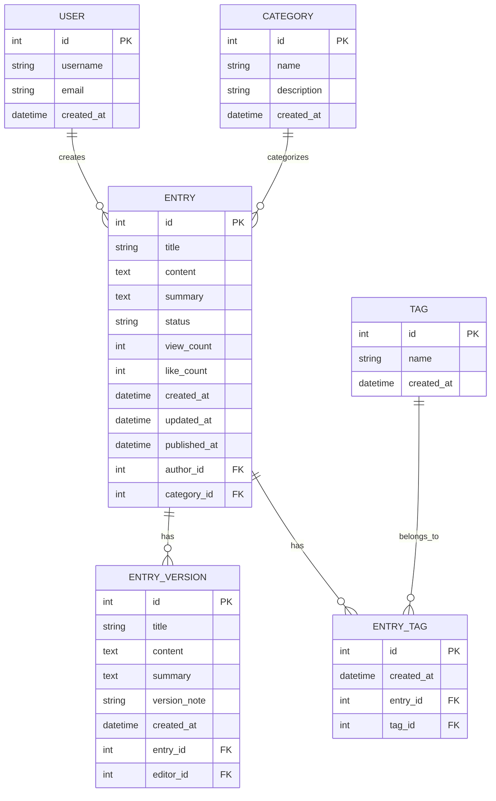

# Django百度百科风格简易项目文档

## 1. 项目概述

### 1.1 项目简介
本项目是一个基于Django框架的百度百科风格知识分享平台，支持词条的创建、编辑、浏览和搜索功能。

### 1.2 技术栈
- **后端**: Django 4.2 + Django REST Framework
- **前端**: Vue.js + React混合架构（使用Veaury框架）
- **数据库**: MySQL 8.0
- **搜索**: Django内置搜索 + 可选Elasticsearch
- **部署**: Docker + Nginx

### 1.3 核心功能
- 词条管理（创建、编辑、删除、浏览）
- 分类管理
- 全文搜索
- 用户权限管理
- 版本历史记录

## 2. 项目基本要求

### 2.1 核心Django组件

#### 2.1.1 模型定义 (Models)
```python
# baike/models.py
from django.db import models
from django.contrib.auth.models import User

class Category(models.Model):
    """分类模型"""
    name = models.CharField(max_length=50, unique=True, verbose_name="分类名称")
    description = models.TextField(blank=True, verbose_name="分类描述")
    created_at = models.DateTimeField(auto_now_add=True)
    
    class Meta:
        verbose_name = "分类"
        verbose_name_plural = "分类"
    
    def __str__(self):
        return self.name

class Entry(models.Model):
    """百科词条模型"""
    STATUS_CHOICES = [
        ('draft', '草稿'),
        ('published', '已发布'),
        ('archived', '已归档'),
    ]
    
    title = models.CharField(max_length=200, verbose_name="词条标题")
    content = models.TextField(verbose_name="词条内容")
    summary = models.TextField(max_length=500, blank=True, verbose_name="摘要")
    category = models.ForeignKey(Category, on_delete=models.SET_NULL, null=True, verbose_name="分类")
    author = models.ForeignKey(User, on_delete=models.CASCADE, verbose_name="作者")
    status = models.CharField(max_length=20, choices=STATUS_CHOICES, default='draft')
    
    # 统计字段
    view_count = models.PositiveIntegerField(default=0, verbose_name="浏览次数")
    like_count = models.PositiveIntegerField(default=0, verbose_name="点赞数")
    
    # 时间字段
    created_at = models.DateTimeField(auto_now_add=True)
    updated_at = models.DateTimeField(auto_now=True)
    published_at = models.DateTimeField(null=True, blank=True)
    
    class Meta:
        verbose_name = "百科词条"
        verbose_name_plural = "百科词条"
        ordering = ['-created_at']
        indexes = [
            models.Index(fields=['title']),
            models.Index(fields=['category']),
            models.Index(fields=['status']),
        ]
    
    def __str__(self):
        return self.title
    
    def save(self, *args, **kwargs):
        # 自动设置发布时间
        if self.status == 'published' and not self.published_at:
            self.published_at = timezone.now()
        super().save(*args, **kwargs)

class EntryVersion(models.Model):
    """词条版本历史"""
    entry = models.ForeignKey(Entry, on_delete=models.CASCADE, related_name='versions')
    title = models.CharField(max_length=200)
    content = models.TextField()
    summary = models.TextField(max_length=500, blank=True)
    editor = models.ForeignKey(User, on_delete=models.CASCADE)
    created_at = models.DateTimeField(auto_now_add=True)
    version_note = models.CharField(max_length=200, blank=True, verbose_name="版本说明")
    
    class Meta:
        verbose_name = "词条版本"
        verbose_name_plural = "词条版本"
        ordering = ['-created_at']

class Tag(models.Model):
    """标签模型"""
    name = models.CharField(max_length=50, unique=True)
    created_at = models.DateTimeField(auto_now_add=True)
    
    class Meta:
        verbose_name = "标签"
        verbose_name_plural = "标签"
    
    def __str__(self):
        return self.name

class EntryTag(models.Model):
    """词条标签关联"""
    entry = models.ForeignKey(Entry, on_delete=models.CASCADE)
    tag = models.ForeignKey(Tag, on_delete=models.CASCADE)
    created_at = models.DateTimeField(auto_now_add=True)
    
    class Meta:
        unique_together = ['entry', 'tag']
        verbose_name = "词条标签"
        verbose_name_plural = "词条标签"
```

#### 2.1.2 视图函数 (Views)
```python
# baike/views.py
from django.shortcuts import render, get_object_or_404
from django.contrib.auth.decorators import login_required
from django.contrib.auth.mixins import LoginRequiredMixin
from django.views.generic import ListView, DetailView, CreateView, UpdateView
from django.urls import reverse_lazy
from django.db.models import Q
from .models import Entry, Category, EntryVersion
from .forms import EntryForm

class EntryListView(ListView):
    """词条列表页"""
    model = Entry
    template_name = 'baike/entry_list.html'
    context_object_name = 'entries'
    paginate_by = 20
    
    def get_queryset(self):
        queryset = Entry.objects.filter(status='published')
        
        # 分类过滤
        category_id = self.request.GET.get('category')
        if category_id:
            queryset = queryset.filter(category_id=category_id)
        
        # 搜索过滤
        search_query = self.request.GET.get('q')
        if search_query:
            queryset = queryset.filter(
                Q(title__icontains=search_query) |
                Q(content__icontains=search_query) |
                Q(summary__icontains=search_query)
            )
        
        return queryset.select_related('author', 'category')
    
    def get_context_data(self, **kwargs):
        context = super().get_context_data(**kwargs)
        context['categories'] = Category.objects.all()
        context['search_query'] = self.request.GET.get('q', '')
        return context

class EntryDetailView(DetailView):
    """词条详情页"""
    model = Entry
    template_name = 'baike/entry_detail.html'
    context_object_name = 'entry'
    
    def get_object(self, queryset=None):
        obj = super().get_object(queryset)
        # 增加浏览次数
        if obj.status == 'published':
            obj.view_count += 1
            obj.save(update_fields=['view_count'])
        return obj
    
    def get_context_data(self, **kwargs):
        context = super().get_context_data(**kwargs)
        context['versions'] = self.object.versions.all()[:10]
        return context

class EntryCreateView(LoginRequiredMixin, CreateView):
    """创建词条页"""
    model = Entry
    form_class = EntryForm
    template_name = 'baike/entry_form.html'
    success_url = reverse_lazy('entry_list')
    
    def form_valid(self, form):
        form.instance.author = self.request.user
        return super().form_valid(form)

class EntryUpdateView(LoginRequiredMixin, UpdateView):
    """编辑词条页"""
    model = Entry
    form_class = EntryForm
    template_name = 'baike/entry_form.html'
    
    def form_valid(self, form):
        # 创建版本历史
        EntryVersion.objects.create(
            entry=self.object,
            title=self.object.title,
            content=self.object.content,
            summary=self.object.summary,
            editor=self.request.user,
            version_note=form.cleaned_data.get('version_note', '常规编辑')
        )
        return super().form_valid(form)
    
    def get_success_url(self):
        return reverse_lazy('entry_detail', kwargs={'pk': self.object.pk})

def search_view(request):
    """搜索视图"""
    query = request.GET.get('q', '')
    results = []
    
    if query:
        results = Entry.objects.filter(
            Q(title__icontains=query) |
            Q(content__icontains=query) |
            Q(summary__icontains=query),
            status='published'
        ).select_related('author', 'category')
    
    return render(request, 'baike/search.html', {
        'query': query,
        'results': results,
        'categories': Category.objects.all()
    })
```

#### 2.1.3 URL路由 (URLs)
```python
# baike/urls.py
from django.urls import path
from . import views

app_name = 'baike'

urlpatterns = [
    # 词条相关
    path('', views.EntryListView.as_view(), name='entry_list'),
    path('entry/<int:pk>/', views.EntryDetailView.as_view(), name='entry_detail'),
    path('entry/create/', views.EntryCreateView.as_view(), name='entry_create'),
    path('entry/<int:pk>/edit/', views.EntryUpdateView.as_view(), name='entry_edit'),
    
    # 搜索
    path('search/', views.search_view, name='search'),
    
    # API接口
    path('api/entries/', views.EntryListAPIView.as_view(), name='api_entry_list'),
    path('api/entries/<int:pk>/', views.EntryDetailAPIView.as_view(), name='api_entry_detail'),
]

# 项目主URL配置
# project/urls.py
from django.contrib import admin
from django.urls import path, include
from django.conf import settings
from django.conf.urls.static import static

urlpatterns = [
    path('admin/', admin.site.urls),
    path('', include('baike.urls')),
    path('api/', include('baike.api_urls')),
]

if settings.DEBUG:
    urlpatterns += static(settings.MEDIA_URL, document_root=settings.MEDIA_ROOT)
    urlpatterns += static(settings.STATIC_URL, document_root=settings.STATIC_ROOT)
```

## 3. 数据模型结构设计

### 3.1 百科词条核心字段规划

#### 3.1.1 必填字段
- **标题 (title)**: 词条名称，最大长度200字符
- **内容 (content)**: 词条详细内容，支持富文本
- **分类 (category)**: 词条所属分类
- **作者 (author)**: 创建词条的用户
- **状态 (status)**: 草稿/已发布/已归档

#### 3.1.2 可选字段
- **摘要 (summary)**: 词条简要介绍，最大500字符
- **标签 (tags)**: 关键词标签
- **封面图片**: 词条封面图
- **参考资料**: 外部引用链接

#### 3.1.3 统计字段
- **浏览次数 (view_count)**: 词条被查看的次数
- **点赞数 (like_count)**: 用户点赞数量
- **收藏数**: 用户收藏数量

#### 3.1.4 时间字段
- **创建时间 (created_at)**: 词条创建时间
- **更新时间 (updated_at)**: 最后修改时间
- **发布时间 (published_at)**: 首次发布时间

### 3.2 数据库关系设计


## 4. 视图功能清单

### 4.1 学生必须实现的关键页面

#### 4.1.1 词条列表页 (`/`)
- **功能**: 显示所有已发布的词条
- **特性**: 
  - 分页显示（每页20条）
  - 按分类筛选
  - 搜索功能
  - 排序选项（按时间、热度）
- **技术要求**: ListView类视图，模板继承

#### 4.1.2 词条详情页 (`/entry/<id>/`)
- **功能**: 显示单个词条的完整内容
- **特性**:
  - 词条内容展示
  - 作者信息和发布时间
  - 浏览计数
  - 编辑历史
  - 相关词条推荐
- **技术要求**: DetailView类视图，上下文数据

#### 4.1.3 创建词条页 (`/entry/create/`)
- **功能**: 创建新的百科词条
- **特性**:
  - 富文本编辑器
  - 分类选择
  - 标签输入
  - 草稿保存
  - 表单验证
- **技术要求**: CreateView类视图，表单处理

#### 4.1.4 编辑词条页 (`/entry/<id>/edit/`)
- **功能**: 修改现有词条内容
- **特性**:
  - 版本历史记录
  - 编辑说明
  - 差异对比
  - 权限控制
- **技术要求**: UpdateView类视图，版本管理

#### 4.1.5 搜索页面 (`/search/`)
- **功能**: 全文搜索词条内容
- **特性**:
  - 关键词搜索
  - 搜索结果高亮
  - 搜索建议
  - 无结果提示
- **技术要求**: 函数视图，Q对象查询

### 4.2 管理功能页面

#### 4.2.1 用户个人中心
- 我的词条列表
- 编辑历史
- 收藏的词条

#### 4.2.2 后台管理界面
- 使用Django Admin
- 词条审核功能
- 用户管理
- 分类管理

## 5. 前端展示要求

### 5.1 模板继承结构

#### 5.1.1 基础模板 (`base.html`)
```html
<!DOCTYPE html>
<html lang="zh-CN">
<head>
    <meta charset="UTF-8">
    <meta name="viewport" content="width=device-width, initial-scale=1.0">
    <title>百科知识库</title>
    
    <!-- CSS框架 -->
    <link href="https://cdn.jsdelivr.net/npm/bootstrap@5.1.3/dist/css/bootstrap.min.css" rel="stylesheet">
    <link href="" rel="stylesheet">
    
    <!-- Vue.js -->
    <script src="https://unpkg.com/vue@3/dist/vue.global.js"></script>
    <!-- React -->
    <script crossorigin src="https://unpkg.com/react@18/umd/react.development.js"></script>
    <script crossorigin src="https://unpkg.com/react-dom@18/umd/react-dom.development.js"></script>
</head>
<body>
    <!-- 导航栏 -->
    <nav class="navbar navbar-expand-lg navbar-light bg-light">
        <div class="container">
            <a class="navbar-brand" href="">百科知识库</a>
            
            <!-- 搜索框 (Vue组件) -->
            <div id="search-app"></div>
            
            <!-- 用户菜单 -->
            <div class="navbar-nav ms-auto">
                
                    <a class="nav-link" href="">创建词条</a>
                    <a class="nav-link" href="">{{ user.username }}</a>
                    <a class="nav-link" href="">退出</a>
                
                    <a class="nav-link" href="">登录</a>
                    <a class="nav-link" href="">注册</a>
                
            </div>
        </div>
    </nav>

    <!-- 主要内容 -->
    <main class="container mt-4">
        
        
    </main>

    <!-- 页脚 -->
    <footer class="bg-light mt-5 py-4">
        <div class="container text-center">
            <p>&copy; 2023 百科知识库. 保留所有权利.</p>
        </div>
    </footer>

    <!-- JavaScript -->
    <script src="https://cdn.jsdelivr.net/npm/bootstrap@5.1.3/dist/js/bootstrap.bundle.min.js"></script>
    
    
</body>
</html>
```

#### 5.1.2 词条列表模板 (`entry_list.html`)
```html



百科词条列表


<div class="row">
    <!-- 侧边栏分类 -->
    <div class="col-md-3">
        <div class="card">
            <div class="card-header">分类</div>
            <div class="card-body">
                <ul class="list-unstyled">
                    <li><a href="?" class="text-decoration-none">全部</a></li>
                    
                    <li><a href="?category={{ category.id }}" class="text-decoration-none">{{ category.name }}</a></li>
                    
                </ul>
            </div>
        </div>
    </div>
    
    <!-- 词条列表 -->
    <div class="col-md-9">
        <h2>百科词条</h2>
        
        <!-- 词条列表 (React组件) -->
        <div id="entry-list-app"></div>
        
        <!-- 分页 -->
        <nav aria-label="Page navigation">
            <ul class="pagination justify-content-center">
                
                    <li class="page-item">
                        <a class="page-link" href="?page={{ page_obj.previous_page_number }}&q={{ search_query }}">上一页</a>
                    </li>
                
                
                
                    <li class="page-item active">
                        <a class="page-link" href="?page={{ num }}&q={{ search_query }}">{{ num }}</a>
                    </li>
                
                
                
                    <li class="page-item">
                        <a class="page-link" href="?page={{ page_obj.next_page_number }}&q={{ search_query }}">下一页</a>
                    </li>
                
            </ul>
        </nav>
    </div>
</div>



<script>
    // React词条列表组件
    const EntryListApp = () => {
        const [entries, setEntries] = React.useState([]);
        
        React.useEffect(() => {
            // 从Django模板获取数据
            const entriesData = JSON.parse('{{ entries_json|escapejs }}');
            setEntries(entriesData);
        }, []);
        
        return React.createElement('div', null,
            entries.map(entry => 
                React.createElement('div', { 
                    key: entry.id, 
                    className: 'card mb-3' 
                },
                    React.createElement('div', { className: 'card-body' },
                        React.createElement('h5', { className: 'card-title' },
                            React.createElement('a', { 
                                href: `/entry/${entry.id}/` 
                            }, entry.title)
                        ),
                        React.createElement('p', { className: 'card-text text-muted' }, 
                            entry.summary || entry.content.substring(0, 150) + '...'
                        ),
                        React.createElement('div', { className: 'd-flex justify-content-between text-muted small' },
                            React.createElement('span', null, `作者: ${entry.author}`),
                            React.createElement('span', null, `浏览: ${entry.view_count}`),
                            React.createElement('span', null, 
                                new Date(entry.created_at).toLocaleDateString()
                            )
                        )
                    )
                )
            )
        );
    };
    
    ReactDOM.render(React.createElement(EntryListApp), document.getElementById('entry-list-app'));
</script>

```

### 5.2 Vue+React混合技术方案

#### 5.2.1 Veaury框架集成
```javascript
// static/js/app.js
import { createApp } from 'vue';
import { applyReactInVue } from 'veaury';

// React搜索组件
const ReactSearchComponent = ({ onSearch }) => {
    const [query, setQuery] = React.useState('');
    
    const handleSearch = () => {
        onSearch(query);
    };
    
    return React.createElement('div', { className: 'input-group' },
        React.createElement('input', {
            type: 'text',
            className: 'form-control',
            placeholder: '搜索词条...',
            value: query,
            onChange: (e) => setQuery(e.target.value),
            onKeyPress: (e) => e.key === 'Enter' && handleSearch()
        }),
        React.createElement('button', {
            className: 'btn btn-outline-secondary',
            type: 'button',
            onClick: handleSearch
        }, '搜索')
    );
};

// Vue应用
const app = createApp({
    components: {
        ReactSearch: applyReactInVue(ReactSearchComponent)
    },
    methods: {
        handleSearch(query) {
            window.location.href = `/search/?q=${encodeURIComponent(query)}`;
        }
    },
    template: `
        <div>
            <ReactSearch @on-search="handleSearch" />
        </div>
    `
});

app.mount('#search-app');
```

#### 5.2.2 组件分工方案
- **Vue组件**: 用于交互性强的部分（搜索、表单验证、实时更新）
- **React组件**: 用于数据展示复杂的部分（词条列表、详情展示）
- **Django模板**: 用于基础布局和服务器端渲染

### 5.3 用户交互界面要求

#### 5.3.1 界面设计原则
- **简洁清晰**: 避免过多装饰，突出内容
- **响应式设计**: 支持桌面和移动设备
- **一致性**: 保持整体风格统一
- **易用性**: 操作流程简单直观

#### 5.3.2 关键交互功能
1. **搜索功能**: 实时搜索建议，搜索结果高亮
2. **词条编辑**: 富文本编辑器，实时预览
3. **分类导航**: 面包屑导航，快速跳转
4. **用户反馈**: 点赞、收藏、评论功能
5. **移动端适配**: 触摸友好的界面设计

## 6. 项目部署和测试

### 6.1 开发环境搭建
```bash
# 创建虚拟环境
python -m venv baike_env
source baike_env/bin/activate  # Linux/Mac
baike_env\Scripts\activate    # Windows

# 安装依赖
pip install django==4.2.0 djangorestframework mysqlclient

# 数据库迁移
python manage.py makemigrations
python manage.py migrate

# 创建超级用户
python manage.py createsuperuser

# 启动开发服务器
python manage.py runserver
```

### 6.2 测试要求
- 单元测试覆盖核心模型和视图
- 集成测试用户操作流程
- 性能测试大数据量场景
- 安全测试用户权限控制

## 7. 作业提交要求

### 7.1 必须提交的内容
1. 完整的Django项目代码
2. 数据库设计文档
3. 功能演示视频（3-5分钟）
4. 项目部署说明
5. 测试报告

### 7.2 评分标准
- **功能完整性** (40%): 所有要求功能是否实现
- **代码质量** (30%): 代码规范、注释、结构
- **界面设计** (20%): 用户体验和界面美观
- **文档质量** (10%): 文档完整性和清晰度

本文档提供了Django百度百科风格项目的完整技术方案，学生可以根据此文档进行项目开发。