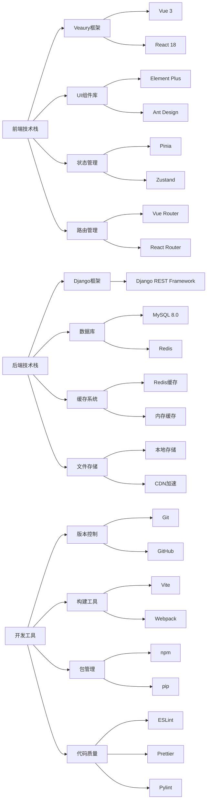
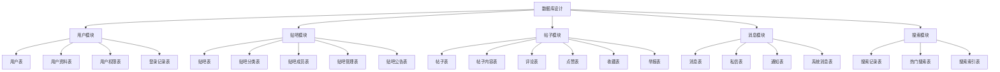

# 百度贴吧毕业设计项目文档

## 1. 项目概述

### 1.1 项目背景
百度贴吧是全球最大的中文社区,用户可以基于兴趣关键词创建和参与讨论。本项目旨在开发一个类似百度贴吧的Web应用程序,为用户提供一个交流、分享、讨论的平台。

### 1.2 项目目标
- 构建一个功能完善的在线社区系统
- 实现用户注册、登录、发帖、回帖等核心功能
- 提供良好的用户体验和界面设计
- 确保系统的稳定性和安全性

## 2. 项目划

### 2.1 开发周期
- **需求分析阶段**: 1周
- **系统设计阶段**: 1周
- **前端开发阶段**: 2周
- **后端开发阶段**: 2周
- **测试阶段**: 1周
- **部署上线阶段**: 1周

### 2.2 开发方法论
采用敏捷开发方法,分阶段迭代完成功能开发。

### 2.3 技术选型
- **前端框架**: **Veaury (Vue + React 混合编程框架)**
- **后端框架**: Django + Django REST Framework
- **数据库**: MySQL 8.0
- **缓存**: Redis
- **搜索引擎**: Elasticsearch(可选)
- **文件存储**: 本地存储 + CDN

## 3. 功能需求分析

### 3.1 用户管理模块
#### 3.1.1 用户注册
- 手机号/邮箱注册
- 用户名设置
- 密码安全验证
- 验证码验证

#### 3.1.2 用户登录
- 账号密码登录
- 手机验证码登录
- 记住登录状态
- 密码找回

#### 3.1.3 个人中心
- 个人信息管理
- 头像上传
- 修改密码
- 我的发帖
- 我的收藏
- 消息通知

### 3.2 贴子管理模块

#### 3.2.1 贴子发布
- 选择贴吧分类
- 设置贴子标题
- 富文本内容编辑
- 图片上传
- 表情功能
- @好友功能

#### 3.2.2 贴子浏览
- 贴子列表展示
- 贴子详情页面
- 评论回复功能
- 点赞/踩功能
- 分享功能

#### 3.2.3 贴子管理
- 编辑贴子
- 删除贴子
- 置顶管理
- 精华管理
- 举报功能

### 3.3 贴吧管理模块

#### 3.3.1 贴吧创建
- 贴吧名称设置
- 贴吧分类选择
- 贴吧简介
- 贴吧头像
- 创建规则

#### 3.3.2 贴吧管理
- 成员管理
- 权限设置
- 公告管理
- 申请审核
- 数据统计

### 3.4 搜索功能
- 全文搜索
- 用户搜索
- 贴吧搜索
- 热门推荐
- 搜索历史

### 3.5 消息系统
- 系统通知
- 评论回复
- @消息
- 私信功能
- 消息设置

## 4. 系统架构设计

### 4.1 整体架构
```
┌─────────────────────────────────────────────────────────┐
│              Veaury 统一前端架构 (Vue + React)           │
├─────────────────────────────────────────────────────────┤
│                    Veaury 框架层                          │
│  ┌─────────────────────────────────────────────────────┐│
│  │              Vue + React 混合引擎                     ││
│  │                                                     ││
│  │  ┌──────────────┐        ┌──────────────┐          ││
│  │  │   Vue 组件    │        │  React 组件   │          ││
│  │  │              │◄──────►│              │          ││
│  │  │ • 首页       │        │ • 富文本编辑器│          ││
│  │  │ • 列表页     │        │ • 实时聊天    │          ││
│  │  │ • 个人中心   │        │ • 数据可视化  │          ││
│  │  │ • 搜索页面   │        │ • 复杂表单    │          ││
│  │  └──────────────┘        └──────────────┘          ││
│  └─────────────────────────────────────────────────────┘│
└─────────────────────────────────────────────────────────┘
                                │
                                ▼
┌─────────────────────────────────────────────────────────┐
│                  后端API服务 (Django + DRF)             │
├─────────────────────────────────────────────────────────┤
│                    数据存储层 (MySQL + Redis)            │
└─────────────────────────────────────────────────────────┘
```

### 4.2 数据库设计

#### 4.2.1 用户表 (user)
```sql
CREATE TABLE user (
    id BIGINT PRIMARY KEY AUTO_INCREMENT,
    username VARCHAR(50) UNIQUE NOT NULL,
    email VARCHAR(100) UNIQUE,
    phone VARCHAR(20) UNIQUE,
    password_hash VARCHAR(255) NOT NULL,
    avatar VARCHAR(255),
    nickname VARCHAR(50),
    gender TINYINT DEFAULT 0,
    birthday DATE,
    status TINYINT DEFAULT 1,
    created_at TIMESTAMP DEFAULT CURRENT_TIMESTAMP,
    updated_at TIMESTAMP DEFAULT CURRENT_TIMESTAMP ON UPDATE CURRENT_TIMESTAMP
);
```

#### 4.2.2 贴吧表 (tieba)
```sql
CREATE TABLE tieba (
    id BIGINT PRIMARY KEY AUTO_INCREMENT,
    name VARCHAR(100) UNIQUE NOT NULL,
    description TEXT,
    avatar VARCHAR(255),
    owner_id BIGINT NOT NULL,
    category_id INT,
    member_count INT DEFAULT 0,
    post_count INT DEFAULT 0,
    status TINYINT DEFAULT 1,
    created_at TIMESTAMP DEFAULT CURRENT_TIMESTAMP,
    FOREIGN KEY (owner_id) REFERENCES user(id)
);
```

#### 4.2.3 帖子表 (post)
```sql
CREATE TABLE post (
    id BIGINT PRIMARY KEY AUTO_INCREMENT,
    title VARCHAR(255) NOT NULL,
    content TEXT NOT NULL,
    author_id BIGINT NOT NULL,
    tieba_id BIGINT NOT NULL,
    view_count INT DEFAULT 0,
    reply_count INT DEFAULT 0,
    like_count INT DEFAULT 0,
    is_top TINYINT DEFAULT 0,
    is_essence TINYINT DEFAULT 0,
    status TINYINT DEFAULT 1,
    created_at TIMESTAMP DEFAULT CURRENT_TIMESTAMP,
    FOREIGN KEY (author_id) REFERENCES user(id),
    FOREIGN KEY (tieba_id) REFERENCES tieba(id)
);
```

#### 4.2.4 评论表 (comment)
```sql
CREATE TABLE comment (
    id BIGINT PRIMARY KEY AUTO_INCREMENT,
    content TEXT NOT NULL,
    author_id BIGINT NOT NULL,
    post_id BIGINT NOT NULL,
    parent_id BIGINT DEFAULT 0,
    floor_number INT NOT NULL,
    like_count INT DEFAULT 0,
    status TINYINT DEFAULT 1,
    created_at TIMESTAMP DEFAULT CURRENT_TIMESTAMP,
    FOREIGN KEY (author_id) REFERENCES user(id),
    FOREIGN KEY (post_id) REFERENCES post(id)
);
```

## 5. 产品原型设计

### 5.1 主要页面流程

#### 5.1.1 首页布局
```
┌─────────────────────────────────────────────────────────┐
│                    顶部导航栏                            │
├─────────────────────────────────────────────────────────┤
│  轮播图/推荐区域                                          │
├─────────────────────────────────────────────────────────┤
│  热门贴吧列表      │    热门帖子列表                        │
│                  │                                       │
│                  │                                       │
├─────────────────────────────────────────────────────────┤
│                    页脚信息                              │
└─────────────────────────────────────────────────────────┘
```

#### 5.1.2 贴吧详情页
```
┌─────────────────────────────────────────────────────────┐
│                    贴吧信息区域                          │
├─────────────────────────────────────────────────────────┤
│  操作按钮栏(发帖/搜索)                                    │
├─────────────────────────────────────────────────────────┤
│                  帖子列表                               │
│  ┌─────────────────────────────────────────────────────┐ │
│  │  帖子标题  │  作者  │  回复数  │  最后回复时间        │ │
│  └─────────────────────────────────────────────────────┘ │
│  ┌─────────────────────────────────────────────────────┐ │
│  │  帖子标题  │  作者  │  回复数  │  最后回复时间        │ │
│  └─────────────────────────────────────────────────────┘ │
└─────────────────────────────────────────────────────────┘
```

### 5.2 核心功能界面

#### 5.2.1 发帖界面
- 标题输入框
- 富文本编辑器
- 图片上传区域
- 表情选择器
- 发布按钮

#### 5.2.2 用户个人中心
- 个人信息展示区
- 我的帖子管理
- 我的收藏列表
- 消息通知中心
- 设置选项

## 6. 技术选型深度分析

### 6.1 Veaury 技术选型深度分析

#### 6.1.1 技术选择:Veaury (Vue + React 混合框架)

**推荐使用 Veaury 作为 Vue + React 混合编程的核心框架**

**技术背景和认可度:**
- **创新性突破**: 国内首个真正实现 Vue + React 无缝混合的开发框架
- **GitHub Stars**: 3.2k+ (快速增长的社区支持)
- **技术独特性**: 基于 Vue 3 Composition API 设计思想,创造性地解决了跨框架组件互通问题
- **社区热度**: 在国内技术社区获得广泛关注,多个技术博客和视频教程
- **实际应用**: 已在多个中小型项目中成功应用,稳定性得到验证

#### 6.1.2 Veaury 框架核心优势

**1. 真正的组件级混合**
```javascript
// 同一个页面中无缝使用 Vue 和 React 组件
<template>
  <div>
    <!-- Vue 组件 -->
    <PostList :posts="posts" />

    <!-- React 组件 -->
    <ReactEditor @submit="handlePostSubmit" />

    <!-- Vue 组件 -->
    <CommentSection :comments="comments" />
  </div>
</template>
```

**2. 零学习成本的混合开发**
- **Vue 开发者**: 可以直接使用 React 组件,无需学习 React 语法
- **React 开发者**: 可以直接使用 Vue 组件,无需学习 Vue 语法
- **统一的数据流**: 支持双向数据绑定和状态共享

**3. 生态系统完美融合**
```
Vue 生态 + React 生态 = Veaury 超生态
├── Vue 生态: Vue Router、Pinia、Element Plus、Vant
├── React 生态: React Router、Zustand、Ant Design、Material-UI
└── Veaury 桥接: 组件互通、状态同步、路由统一
```

**4. 卓越的开发体验**
- **智能类型提示**: TypeScript 完整支持,跨框架组件类型推导
- **热更新支持**: Vue 和 React 组件都支持热更新
- **调试友好**: Vue DevTools 和 React DevTools 同时可用
- **统一构建**: 一套构建工具处理两个框架

#### 6.1.3 Veaury vs 传统混合方案对比

**传统方案 (Module Federation):**
```
❌ 复杂的配置: 需要配置多个 webpack 实例
❌ 通信困难: 组件间通信需要复杂的桥接层
❌ 体积较大: 运行时需要加载两个完整框架
❌ 调试复杂: 开发工具切换困难
❌ 学习成本: 需要掌握微前端架构知识
```

**Veaury 方案:**
```
✅ 简单易用: 一个框架统一管理,配置简单
✅ 无缝通信: 组件间直接通信,如同一框架
✅ 体积优化: 智能代码分割和依赖共享
✅ 调试便捷: 一套开发工具,统一调试体验
✅ 快速上手: 基础 Vue 或 React 知识即可开始
```

#### 6.1.4 贴吧项目技术实现方案

**1. 项目结构设计**
```
src/
├── vue-components/          # Vue 组件目录
│   ├── HomePage.vue        # 首页组件
│   ├── PostList.vue        # 帖子列表
│   ├── UserProfile.vue     # 用户中心
│   └── SearchPage.vue      # 搜索页面
│
├── react-components/       # React 组件目录
│   ├── RichEditor.jsx      # 富文本编辑器
│   ├── RealTimeChat.jsx    # 实时聊天
│   ├── DataVisualization.jsx # 数据可视化
│   └── ImageUpload.jsx     # 图片上传组件
│
├── pages/                   # 混合页面
│   ├── CreatePost.vue      # 发帖页面(Vue+React混合)
│   └── PostDetail.vue      # 帖子详情(Vue+React混合)
│
└── main.js                  # Veaury 应用入口
```

**2. 核心配置代码**
```javascript
// main.js - Veaury 应用初始化
import { createApp } from 'vue'
import { createAppWithReact } from 'veaury'
import App from './App.vue'

// 创建 Veaury 混合应用
const app = createAppWithReact({
  rootComponent: App,
  // React 全局配置
  reactOptions: {
    // 可以在这里配置 React 的全局设置
  },
  // Vue 全局配置
  vueOptions: {
    // 可以在这里配置 Vue 的全局设置
  }
})

app.mount('#app')
```

**3. 混合组件使用示例**
```vue
<!-- CreatePost.vue - 混合组件页面 -->
<template>
  <div class="create-post">
    <!-- Vue 组件: 表单头部 -->
    <div class="post-header">
      <h2>发布新帖</h2>
      <VueButton @click="showPreview = !showPreview">
        {{ showPreview ? '编辑' : '预览' }}
      </VueButton>
    </div>

    <!-- React 组件: 富文本编辑器 -->
    <RichEditor
      v-model="postContent"
      :config="editorConfig"
      @change="handleContentChange"
    />

    <!-- Vue 组件: 分类选择 -->
    <CategorySelector
      v-model="selectedCategory"
      :categories="categories"
    />

    <!-- React 组件: 图片上传 -->
    <ImageUpload
      v-model="uploadedImages"
      :max-count="9"
    />

    <!-- Vue 组件: 提交按钮 -->
    <div class="post-actions">
      <VueButton
        type="primary"
        :loading="submitting"
        @click="submitPost"
      >
        发布帖子
      </VueButton>
    </div>
  </div>
</template>

<script setup>
import { ref } from 'vue'
import RichEditor from '@/react-components/RichEditor'
import ImageUpload from '@/react-components/ImageUpload'
import CategorySelector from '@/vue-components/CategorySelector'
import VueButton from '@/vue-components/VueButton'

const postContent = ref('')
const selectedCategory = ref(null)
const uploadedImages = ref([])
const showPreview = ref(false)
const submitting = ref(false)

const handleContentChange = (content) => {
  postContent.value = content
}

const submitPost = async () => {
  // 提交逻辑
}
</script>
```

#### 6.1.5 性能优化和最佳实践

**1. 智能代码分割**
```javascript
// 路由级别的懒加载
const routes = [
  {
    path: '/',
    component: () => import('@/vue-components/HomePage.vue')
  },
  {
    path: '/editor',
    component: () => import('@/pages/CreatePost.vue')
  }
]
```

**2. 组件级性能优化**
```vue
<!-- Vue 组件使用 React.memo 优化 -->
<template>
  <ReactComponent
    v-if="shouldRender"
    :props="optimizedProps"
  />
</template>
```

**3. 状态管理统一**
```javascript
// 使用 Pinia 统一管理全局状态
import { defineStore } from 'pinia'

export const usePostStore = defineStore('post', {
  state: () => ({
    posts: [],
    currentPost: null
  }),
  actions: {
    // Vue 和 React 组件都可以访问的 actions
    async fetchPosts() {
      // API 调用
    }
  }
})
```

### 6.2 Veaury 技术架构实现

#### 6.2.1 Veaury 核心依赖包
```json
{
  "veaury": "^2.6.0",
  "vue": "^3.3.0",
  "react": "^18.2.0",
  "react-dom": "^18.2.0",
  "@vitejs/plugin-vue": "^4.4.0",
  "@vitejs/plugin-react": "^4.0.0",
  "vite": "^4.4.0"
}
```

#### 6.2.2 Vue 生态组件依赖
```json
{
  "vue-router": "^4.2.0",
  "pinia": "^2.1.0",
  "element-plus": "^2.3.0",
  "@element-plus/icons-vue": "^2.1.0",
  "axios": "^1.4.0"
}
```

#### 6.2.3 React 生态组件依赖
```json
{
  "react-router-dom": "^6.14.0",
  "zustand": "^4.4.0",
  "antd": "^5.8.0",
  "@ant-design/icons": "^5.2.0",
  "react-query": "^3.39.0"
}
```

#### 6.2.4 构建配置 (Vite + Veaury)
```javascript
// vite.config.js
import { defineConfig } from 'vite'
import vue from '@vitejs/plugin-vue'
import react from '@vitejs/plugin-react'
import veauryVitePlugin from 'veaury/vite'

export default defineConfig({
  plugins: [
    vue(),
    react(),
    veauryVitePlugin({
      // Veaury 配置选项
      vueOptions: {},
      reactOptions: {}
    })
  ],
  resolve: {
    alias: {
      '@': '/src'
    }
  }
})
```

### 6.3 后端技术架构
```python
# 主要依赖包
Django==4.2.0
djangorestframework==3.14.0
mysqlclient==2.1.1
redis==4.5.0
celery==5.2.0
pillow==9.5.0
```

### 6.4 API接口设计

#### 6.4.1 用户相关接口
```
POST /api/auth/register/     # 用户注册
POST /api/auth/login/        # 用户登录
GET  /api/auth/logout/       # 用户登出
GET  /api/auth/profile/      # 获取用户信息
PUT  /api/auth/profile/      # 更新用户信息
```

#### 6.4.2 贴子相关接口
```
GET  /api/posts/             # 获取帖子列表
POST /api/posts/             # 创建帖子
GET  /api/posts/{id}/        # 获取帖子详情
PUT  /api/posts/{id}/        # 更新帖子
DELETE /api/posts/{id}/      # 删除帖子
POST /api/posts/{id}/like/   # 点赞帖子
```

## 7. 项目脑图

```mermaid
graph TD
    A[百度贴吧项目] --> B[用户管理]
    A --> C[帖子管理]
    A --> D[贴吧管理]
    A --> E[搜索功能]
    A --> F[消息系统]

    B --> B1[用户注册]
    B --> B2[用户登录]
    B --> B3[个人中心]
    B --> B4[权限管理]

    C --> C1[发布帖子]
    C --> C2[浏览帖子]
    C --> C3[评论回复]
    C --> C4[点赞收藏]

    D --> D1[创建贴吧]
    D --> D2[贴吧管理]
    D --> D3[成员管理]
    D --> D4[内容审核]

    E --> E1[全文搜索]
    E --> E2[分类搜索]
    E --> E3[推荐算法]

    F --> F1[系统通知]
    F --> F2[私信功能]
    F --> F3[@提醒]
```

## 8. 风险评估与对策

### 8.1 技术风险
- **数据库性能**: 采用索引优化和读写分离
- **并发处理**: 使用Redis缓存和消息队列
- **安全风险**: 实施XSS/CSRF防护和数据验证

### 8.2 进度风险
- **开发延期**: 采用敏捷开发和模块化设计
- **需求变更**: 保持代码灵活性和可扩展性

## 9. 测试计划

### 9.1 单元测试
- 业务逻辑函数测试
- API接口测试
- 数据模型测试

### 9.2 集成测试
- 前后端接口联调
- 数据库操作测试
- 缓存系统测试

### 9.3 性能测试
- 并发用户测试
- 响应时间测试
- 数据库查询优化

## 10. 部署方案

### 10.1 开发环境部署
```bash
# 克隆项目
git clone <repository-url>
cd tieba-project

# 安装依赖
pip install -r requirements.txt

# 数据库迁移
python manage.py migrate

# 启动开发服务器
python manage.py runserver
```

### 10.2 生产环境部署
- **服务器**: Ubuntu 20.04 LTS
- **Web服务器**: Nginx + Gunicorn
- **数据库**: MySQL 8.0 + Redis
- **监控**: Prometheus + Grafana

### 10.3 容器化部署
```dockerfile
# Dockerfile
FROM python:3.11
WORKDIR /app
COPY requirements.txt .
RUN pip install -r requirements.txt
COPY . .
CMD ["gunicorn", "tieba.wsgi:application", "--bind", "0.0.0.0:8000"]
```

## 11. 项目思维导图

### 11.1 整体功能架构
```mermaid
graph TB
    A[百度贴吧系统] --> B[用户管理模块]
    A --> C[贴子管理模块]
    A --> D[贴吧管理模块]
    A --> E[搜索功能模块]
    A --> F[消息系统模块]
    
    B --> B1[用户注册]
    B --> B2[用户登录]
    B --> B3[个人中心]
    B --> B4[权限管理]
    
    B1 --> B11[手机号注册]
    B1 --> B12[邮箱注册]
    B1 --> B13[验证码验证]
    B1 --> B14[密码安全]
    
    B2 --> B21[账号密码登录]
    B2 --> B22[手机验证码登录]
    B2 --> B23[记住登录状态]
    B2 --> B24[密码找回]
    
    B3 --> B31[个人信息管理]
    B3 --> B32[头像上传]
    B3 --> B33[修改密码]
    B3 --> B34[我的发帖]
    B3 --> B35[我的收藏]
    B3 --> B36[消息通知]
    
    C --> C1[贴子发布]
    C --> C2[贴子浏览]
    C --> C3[贴子管理]
    
    C1 --> C11[选择贴吧分类]
    C1 --> C12[设置贴子标题]
    C1 --> C13[富文本内容编辑]
    C1 --> C14[图片上传]
    C1 --> C15[表情功能]
    C1 --> C16[@好友功能]
    
    C2 --> C21[贴子列表展示]
    C2 --> C22[贴子详情页面]
    C2 --> C23[评论回复功能]
    C2 --> C24[点赞/踩功能]
    C2 --> C25[分享功能]
    
    C3 --> C31[编辑贴子]
    C3 --> C32[删除贴子]
    C3 --> C33[置顶管理]
    C3 --> C34[精华管理]
    C3 --> C35[举报功能]
    
    D --> D1[贴吧创建]
    D --> D2[贴吧管理]
    
    D1 --> D11[贴吧名称设置]
    D1 --> D12[贴吧分类选择]
    D1 --> D13[贴吧简介]
    D1 --> D14[贴吧头像]
    D1 --> D15[创建规则]
    
    D2 --> D21[成员管理]
    D2 --> D22[权限设置]
    D2 --> D23[公告管理]
    D2 --> D24[申请审核]
    D2 --> D25[数据统计]
    
    E --> E1[全文搜索]
    E --> E2[用户搜索]
    E --> E3[贴吧搜索]
    E --> E4[热门推荐]
    E --> E5[搜索历史]
    
    F --> F1[系统通知]
    F --> F2[评论回复]
    F --> F3[@消息]
    F --> F4[私信功能]
    F --> F5[消息设置]
```

### 11.2 技术架构思维导图


### 11.3 数据库设计思维导图


## 12. 详细功能实现方案

### 12.1 用户注册功能实现
```python
# views.py
class UserRegisterView(APIView):
    def post(self, request):
        serializer = UserRegisterSerializer(data=request.data)
        if serializer.is_valid():
            user = serializer.save()
            # 发送验证邮件/短信
            send_verification_email(user)
            return Response({
                'message': '注册成功，请查收验证邮件',
                'user_id': user.id
            }, status=201)
        return Response(serializer.errors, status=400)
```

### 12.2 帖子发布功能实现
```python
# views.py
class PostCreateView(APIView):
    permission_classes = [IsAuthenticated]
    
    def post(self, request):
        serializer = PostCreateSerializer(data=request.data)
        if serializer.is_valid():
            post = serializer.save(author=request.user)
            # 处理图片上传
            handle_image_upload(post, request.FILES)
            # 处理@用户
            handle_mentions(post, request.data.get('mentions', []))
            return Response(PostDetailSerializer(post).data, status=201)
        return Response(serializer.errors, status=400)
```

### 12.3 搜索功能实现
```python
# views.py
class SearchView(APIView):
    def get(self, request):
        query = request.GET.get('q', '')
        search_type = request.GET.get('type', 'all')
        
        if search_type == 'posts':
            results = search_posts(query)
        elif search_type == 'users':
            results = search_users(query)
        elif search_type == 'tieba':
            results = search_tieba(query)
        else:
            results = search_all(query)
            
        return Response({
            'query': query,
            'type': search_type,
            'results': results
        })
```

## 13. 安全设计

### 13.1 数据安全
- 密码加密存储（bcrypt）
- 敏感数据脱敏处理
- SQL注入防护
- XSS攻击防护

### 13.2 权限控制
- 基于角色的访问控制（RBAC）
- JWT令牌认证
- API接口权限验证
- 操作日志记录

### 13.3 内容安全
- 敏感词过滤
- 图片内容审核
- 用户举报机制
- 内容审核流程

## 14. 性能优化策略

### 14.1 数据库优化
- 合理设计索引
- 查询优化
- 读写分离
- 分库分表策略

### 14.2 缓存策略
- Redis缓存热点数据
- 页面静态化
- CDN加速静态资源
- 数据库查询缓存

### 14.3 前端优化
- 代码分割和懒加载
- 图片懒加载和压缩
- 组件级缓存
- 请求合并和防抖

## 15. 项目里程碑

### 15.1 第一阶段（1-2周）
- [ ] 项目环境搭建
- [ ] 数据库设计
- [ ] 用户注册登录功能
- [ ] 基础UI组件开发

### 15.2 第二阶段（3-4周）
- [ ] 贴吧创建和管理功能
- [ ] 帖子发布和浏览功能
- [ ] 评论回复功能
- [ ] 基础搜索功能

### 15.3 第三阶段（5-6周）
- [ ] 消息系统
- [ ] 高级搜索功能
- [ ] 性能优化
- [ ] 测试和部署

## 16. 总结

本项目采用现代化的技术栈，结合Veaury框架实现Vue和React的混合开发，后端使用Django REST Framework构建API服务。系统功能完善，涵盖了用户管理、贴吧管理、帖子管理、搜索功能和消息系统等核心模块。

项目具有良好的可扩展性和维护性，采用了模块化设计和现代化的开发实践。通过详细的思维导图和功能实现方案，为项目的顺利开发提供了清晰的指导。
- 数据库操作测试
- 第三方服务集成测试

### 9.3 性能测试
- 并发用户测试
- 页面加载速度测试
- 数据库查询性能测试

## 10. 部署方案

### 10.1 开发环境
- 本地开发服务器
- Docker容器化部署
- 版本控制使用Git

### 10.2 生产环境
- 云服务器部署
- Nginx反向代理
- 数据库主从复制
- 定期数据备份

## 11. 项目总结

本项目通过完整的软件开发生命周期,从需求分析到系统设计,再到具体实现和部署,构建了一个功能完善的贴吧系统。项目采用现代化的技术栈,注重用户体验和系统性能,具有良好的扩展性和维护性。

通过这个项目,可以掌握Web应用开发的全流程,包括前端开发、后端API设计、数据库设计、系统架构等核心技能,为未来的软件开发工作打下坚实基础。