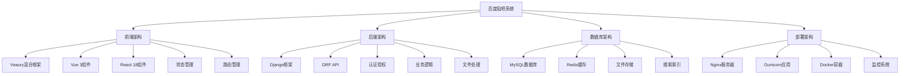
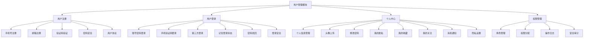
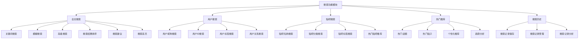
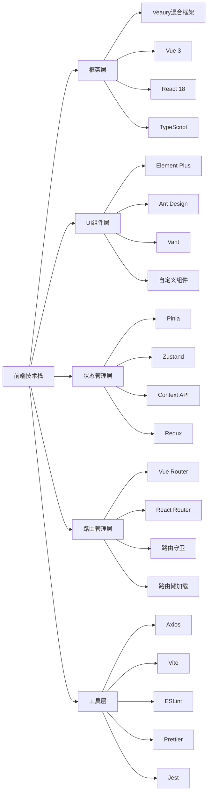
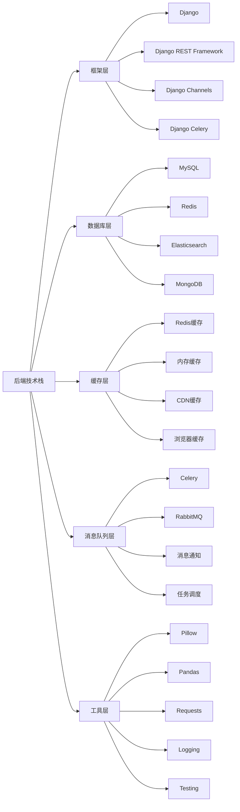
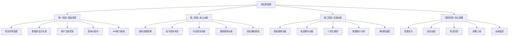

# 百度贴吧项目思维导图

## 1. 项目整体架构



## 2. 功能模块思维导图

### 2.1 用户管理模块



### 2.2 贴子管理模块

```mermaid
graph TB
    B[贴子管理模块] --> B1[贴子发布]
    B --> B2[贴子浏览]
    B --> B3[贴子管理]
    B --> B4[互动功能]
    
    B1 --> B11[选择贴吧分类]
    B1 --> B12[设置贴子标题]
    B1 --> B13[富文本内容编辑]
    B1 --> B14[图片上传]
    B1 --> B15[表情功能]
    B1 --> B16[@好友功能]
    B1 --> B17[话题标签]
    B1 --> B18[草稿保存]
    
    B2 --> B21[贴子列表展示]
    B2 --> B22[贴子详情页面]
    B2 --> B23[评论回复功能]
    B2 --> B24[楼层显示]
    B2 --> B25[图片预览]
    B2 --> B26[内容搜索]
    B2 --> B27[排序功能]
    B2 --> B28[筛选功能]
    
    B3 --> B31[编辑贴子]
    B3 --> B32[删除贴子]
    B3 --> B33[置顶管理]
    B3 --> B34[精华管理]
    B3 --> B35[举报功能]
    B3 --> B36[内容审核]
    B3 --> B37[数据统计]
    B3 --> B38[批量操作]
    
    B4 --> B41[点赞/踩功能]
    B4 --> B42[收藏功能]
    B4 --> B43[分享功能]
    B4 --> B44[关注功能]
    B4 --> B45[举报功能]
    B4 --> B46[打赏功能]
```

### 2.3 贴吧管理模块

```mermaid
graph TB
    C[贴吧管理模块] --> C1[贴吧创建]
    C --> C2[贴吧管理]
    C --> C3[成员管理]
    C --> C4[内容管理]
    
    C1 --> C11[贴吧名称设置]
    C1 --> C12[贴吧分类选择]
    C1 --> C13[贴吧简介]
    C1 --> C14[贴吧头像]
    C1 --> C15[创建规则]
    C1 --> C16[权限设置]
    C1 --> C17[审核流程]
    
    C2 --> C21[成员管理]
    C2 --> C22[权限设置]
    C2 --> C23[公告管理]
    C2 --> C24[申请审核]
    C2 --> C25[数据统计]
    C2 --> C26[吧务团队]
    C2 --> C27[吧规设置]
    C2 --> C28[吧务日志]
    
    C3 --> C31[成员列表]
    C3 --> C32[权限分配]
    C3 --> C33[成员审核]
    C3 --> C34[黑名单管理]
    C3 --> C35[活跃度统计]
    C3 --> C36[成员等级]
    
    C4 --> C41[内容审核]
    C4 --> C42[敏感词过滤]
    C4 --> C43[举报处理]
    C4 --> C44[内容推荐]
    C4 --> C45[数据备份]
```



### 2.4 搜索功能模块



### 2.5 消息系统模块

```mermaid
graph TB
    E[消息系统模块] --> E1[系统通知]
    E --> E2[评论回复]
    E --> E3[@消息]
    E --> E4[私信功能]
    E --> E5[消息设置]
    
    E1 --> E11[系统公告]
    E1 --> E12[吧务通知]
    E1 --> E13[审核通知]
    E1 --> E14[安全通知]
    E1 --> E15[活动通知]
    
    E2 --> E21[评论通知]
    E2 --> E22[回复通知]
    E2 --> E23[点赞通知]
    E2 --> E24[收藏通知]
    E2 --> E25[关注通知]
    
    E3 --> E31[@用户通知]
    E3 --> E32[@贴吧通知]
    E3 --> E33[批量@功能]
    E3 --> E34[@权限控制]
    
    E4 --> E41[一对一私信]
    E4 --> E42[群聊功能]
    E4 --> E43[文件传输]
    E4 --> E44[消息撤回]
    E4 --> E45[消息加密]
    E4 --> E46[聊天记录]
    
    E5 --> E51[消息接收设置]
    E5 --> E52[消息推送设置]
    E5 --> E53[免打扰设置]
    E5 --> E54[消息过滤]
    E5 --> E55[消息备份]
```

## 3. 技术架构思维导图

### 3.1 前端技术栈



### 3.2 后端技术栈



### 3.3 数据库设计思维导图

```mermaid
graph TB
    C[数据库设计] --> C1[用户模块]
    C --> C2[贴吧模块]
    C --> C3[帖子模块]
    C --> C4[消息模块]
    C --> C5[搜索模块]
    C --> C6[系统模块]
    
    C1 --> C11[用户表]
    C1 --> C12[用户资料表]
    C1 --> C13[用户权限表]
    C1 --> C14[登录记录表]
    C1 --> C15[用户统计表]
    
    C2 --> C21[贴吧表]
    C2 --> C22[贴吧分类表]
    C2 --> C23[贴吧成员表]
    C2 --> C24[贴吧管理表]
    C2 --> C25[贴吧公告表]
    C2 --> C26[贴吧统计表]
    
    C3 --> C31[帖子表]
    C3 --> C32[帖子内容表]
    C3 --> C33[评论表]
    C3 --> C34[点赞表]
    C3 --> C35[收藏表]
    C3 --> C36[举报表]
    C3 --> C37[帖子统计表]
    
    C4 --> C41[消息表]
    C4 --> C42[私信表]
    C4 --> C43[通知表]
    C4 --> C44[系统消息表]
    C4 --> C45[消息统计表]
    
    C5 --> C51[搜索记录表]
    C5 --> C52[热门搜索表]
    C5 --> C53[搜索索引表]
    C5 --> C54[推荐算法表]
    
    C6 --> C61[系统配置表]
    C6 --> C62[操作日志表]
    C6 --> C63[错误日志表]
    C6 --> C64[数据备份表]
```



## 4. 开发流程思维导图

```mermaid
graph TB
    A[开发流程] --> A1[需求分析]
    A --> A2[系统设计]
    A --> A3[前端开发]
    A --> A4[后端开发]
    A --> A5[测试部署]
    A --> A6[运维监控]
    
    A1 --> A11[功能需求分析]
    A1 --> A12[技术可行性分析]
    A1 --> A13[风险评估]
    A1 --> A14[项目计划制定]
    
    A2 --> A21[系统架构设计]
    A2 --> A22[数据库设计]
    A2 --> A23[API接口设计]
    A2 --> A24[UI/UX设计]
    A2 --> A25[技术选型]
    
    A3 --> A31[前端框架搭建]
    A3 --> A32[组件开发]
    A3 --> A33[页面开发]
    A3 --> A34[交互逻辑实现]
    A3 --> A35[性能优化]
    
    A4 --> A41[后端框架搭建]
    A4 --> A42[数据库模型]
    A4 --> A43[API接口实现]
    A4 --> A44[业务逻辑开发]
    A4 --> A45[安全防护]
    
    A5 --> A51[单元测试]
    A5 --> A52[集成测试]
    A5 --> A53[性能测试]
    A5 --> A54[部署上线]
    A5 --> A55[用户验收]
    
    A6 --> A61[系统监控]
    A6 --> A62[日志分析]
    A6 --> A63[性能优化]
    A6 --> A64[安全维护]
    A6 --> A65[功能迭代]
```



## 5. 项目里程碑思维导图



## 6. 总结

本思维导图全面展示了百度贴吧Django项目的整体架构、功能模块、技术栈和开发流程。通过可视化的方式，清晰地呈现了项目的各个层面，为项目的规划、开发和维护提供了完整的指导框架。

每个模块都包含了详细的子功能和技术实现方案，确保项目开发的有序性和完整性。思维导图的形式有助于团队成员快速理解项目结构，提高开发效率。